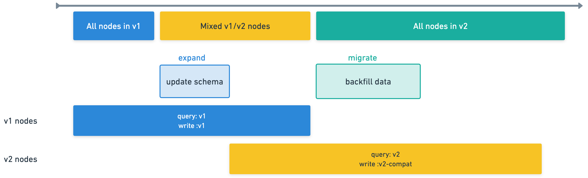

## Goals
1. Provide a consistent data model for the application to depend on.
2. Allow fields in the data model to be consistently filtered/sorted/aggregated on.
3. Implement an approach that can accommodate "nested schemas". (Details TBD)

## Approach

1. When there's a backward or forward incompatible change, you need a new data-model version. If you are adding/removing an optional field, a new data model version is not required.
2. When reading a document, if its version is less than the most recent data model version, the `up` migration of each relevant data model is ran to update the document.
3. After applying all relevant `up` migrations, the document is ran through the specifed `schema` to drop all unknown fields. (The examples having to explicitly specify `unknowns: 'ignore'` should be addressed, this shouldn't need to be explicit). The schema is NOT the schema of the document, it's the schema of the data model that will be returned from the SOR.
4. The `onWrite` of the most recent data model version is ran when writing the doc. This is because we assume that we only need to be doing backward-compatibility writes for N-1, not N-2.
5. When writing documents, the framework will set the `version` field to the most recent data-model version.
6. If a data model version needs a backfill to be ran, it should explicitly specify `backfill: true`
    1. The backfill of the most recent data model will be ran after Kibana is running and reading/writing documents. In Serverless, this will be triggered after all old Kibana nodes have been stopped.
    2. If there is a backfill from an older data model that has not ran against all documents, it should be ran BEFORE Kibana is running and reading/writing documents. This is intended to prevent issues in ESS or on-prem where people skip versions, but we don't want application code to need to take the possibility that data isn't populated into consideration.
